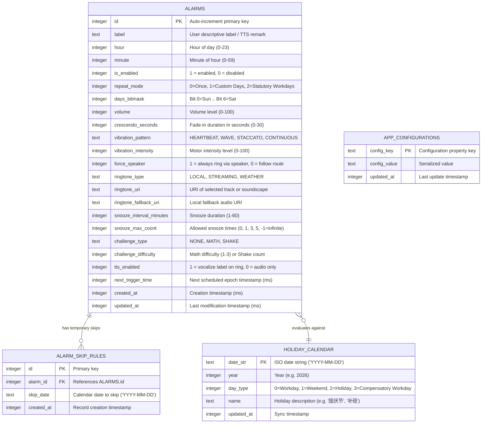
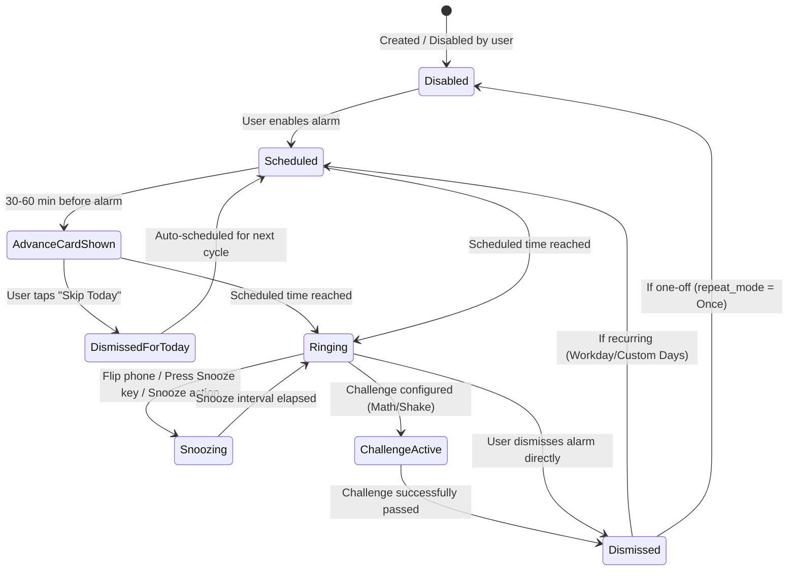

# Data Model: Android Smart Alarm

**Feature**: `001-android-smart-alarm`
**Date**: 2026-09-13
**Storage Engine**: Direct SQLite (`android.database.sqlite`)

---

## 1. Relational Entities & SQLite Schema



---

## 2. DDL Specification

```sql
-- Core Alarms Table
CREATE TABLE IF NOT EXISTS alarms (
    id INTEGER PRIMARY KEY AUTOINCREMENT,
    label TEXT NOT NULL DEFAULT '',
    hour INTEGER NOT NULL CHECK (hour >= 0 AND hour <= 23),
    minute INTEGER NOT NULL CHECK (minute >= 0 AND minute <= 59),
    is_enabled INTEGER NOT NULL DEFAULT 1 CHECK (is_enabled IN (0, 1)),
    repeat_mode INTEGER NOT NULL DEFAULT 0 CHECK (repeat_mode IN (0, 1, 2)),
    days_bitmask INTEGER NOT NULL DEFAULT 0,
    volume INTEGER NOT NULL DEFAULT 80 CHECK (volume >= 0 AND volume <= 100),
    crescendo_seconds INTEGER NOT NULL DEFAULT 15 CHECK (crescendo_seconds >= 0 AND crescendo_seconds <= 30),
    vibration_pattern TEXT NOT NULL DEFAULT 'HEARTBEAT',
    vibration_intensity INTEGER NOT NULL DEFAULT 80 CHECK (vibration_intensity >= 0 AND vibration_intensity <= 100),
    force_speaker INTEGER NOT NULL DEFAULT 1 CHECK (force_speaker IN (0, 1)),
    ringtone_type TEXT NOT NULL DEFAULT 'LOCAL',
    ringtone_uri TEXT NOT NULL DEFAULT 'content://settings/system/alarm_alert',
    ringtone_fallback_uri TEXT NOT NULL DEFAULT 'android.resource://system/alarm_beep',
    snooze_interval_minutes INTEGER NOT NULL DEFAULT 10 CHECK (snooze_interval_minutes >= 1 AND snooze_interval_minutes <= 60),
    snooze_max_count INTEGER NOT NULL DEFAULT 3,
    challenge_type TEXT NOT NULL DEFAULT 'NONE',
    challenge_difficulty INTEGER NOT NULL DEFAULT 1,
    tts_enabled INTEGER NOT NULL DEFAULT 0 CHECK (tts_enabled IN (0, 1)),
    next_trigger_time INTEGER NOT NULL DEFAULT 0,
    created_at INTEGER NOT NULL,
    updated_at INTEGER NOT NULL
);

CREATE INDEX IF NOT EXISTS idx_alarms_next_trigger ON alarms(is_enabled, next_trigger_time);

-- Temporary Skip / Vacation Rules Table
CREATE TABLE IF NOT EXISTS alarm_skip_rules (
    id INTEGER PRIMARY KEY AUTOINCREMENT,
    alarm_id INTEGER NOT NULL REFERENCES alarms(id) ON DELETE CASCADE,
    skip_date TEXT NOT NULL,
    created_at INTEGER NOT NULL,
    UNIQUE(alarm_id, skip_date)
);

CREATE INDEX IF NOT EXISTS idx_alarm_skip_date ON alarm_skip_rules(alarm_id, skip_date);

-- China Statutory Holiday & Compensatory Workday Cache Table
CREATE TABLE IF NOT EXISTS holiday_calendar (
    date_str TEXT PRIMARY KEY,
    year INTEGER NOT NULL,
    day_type INTEGER NOT NULL CHECK (day_type IN (0, 1, 2, 3)),
    name TEXT NOT NULL DEFAULT '',
    updated_at INTEGER NOT NULL
);

CREATE INDEX IF NOT EXISTS idx_holiday_year ON holiday_calendar(year);

-- Key-Value Persistence for Global App Configuration
CREATE TABLE IF NOT EXISTS app_configurations (
    config_key TEXT PRIMARY KEY,
    config_value TEXT NOT NULL,
    updated_at INTEGER NOT NULL
);
```

---

## 3. State Transitions

### Alarm Lifecycle State Machine



---

## 4. Validation Rules & Data Invariants

1. **Time Invariants**:
   - `0 <= hour <= 23`
   - `0 <= minute <= 59`
   - `next_trigger_time` must always be calculated as epoch milliseconds in the future relative to the moment of scheduling.
2. **Repeat Modes**:
   - `repeat_mode = 0` (Once): Upon dismissal or single skip, `is_enabled` transitions to `0`.
   - `repeat_mode = 1` (Custom Days): `days_bitmask` must have at least one bit set ($1 \le \text{bitmask} \le 127$).
   - `repeat_mode = 2` (Statutory Workdays): `next_trigger_time` must be resolved by querying `holiday_calendar` to skip dates with `day_type = 2` (Statutory Holiday) and include dates with `day_type = 3` (Compensatory Workday).
3. **Skip Rule Deletion**:
   - Expired `alarm_skip_rules` (`skip_date < CURRENT_DATE`) are automatically purged upon alarm database maintenance checks to conserve storage.
