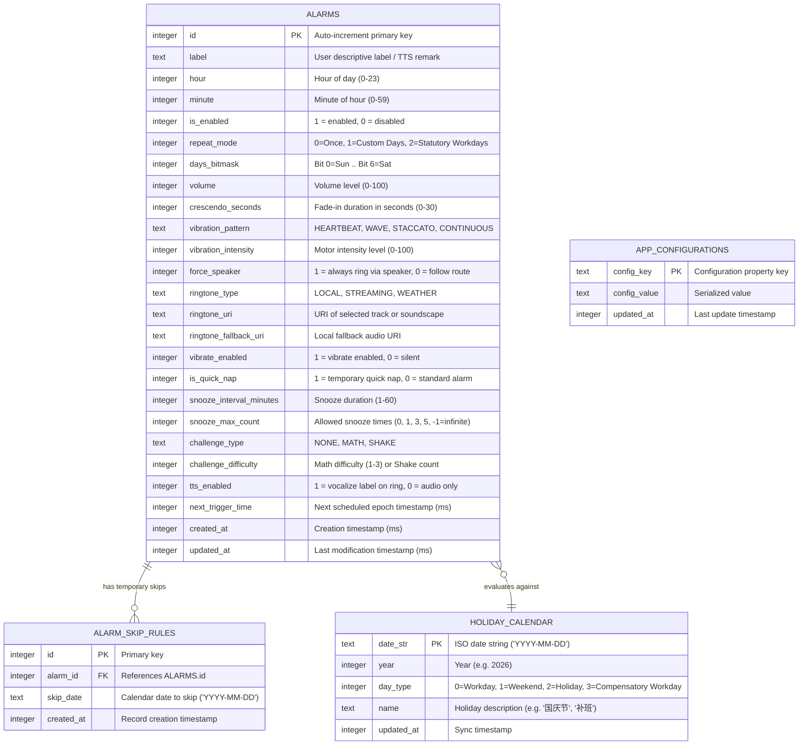
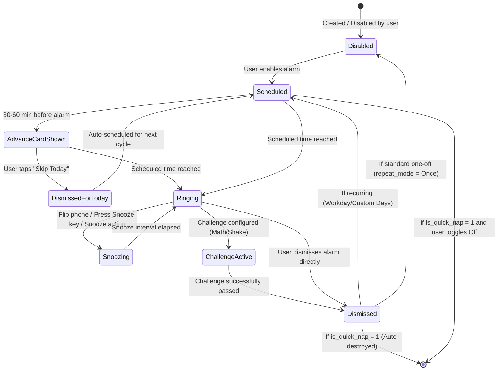
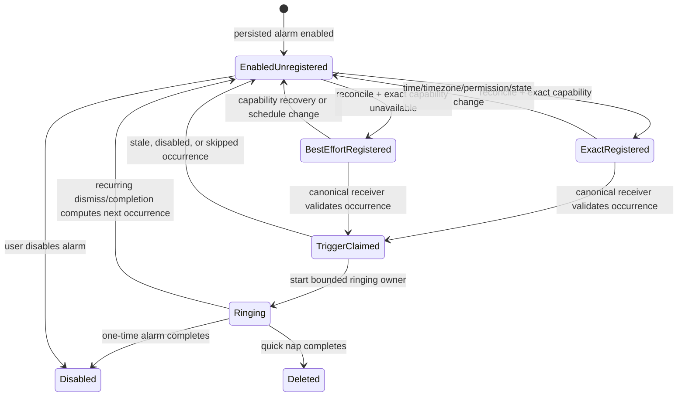

# Data Model: Android Smart Alarm

**Feature**: `001-android-smart-alarm`
**Date**: 2026-09-14
**Storage Engine**: Direct SQLite (`android.database.sqlite`)

> The schema below remains the feature's target persistence model. The alarm-delivery repair does not migrate the current Android SharedPreferences JSON store to SQLite, but it does evolve that JSON backward-compatibly with the minimal durable occurrence fields required for stale/duplicate rejection and recovery.

---

## 1. Relational Entities & SQLite Schema



---

## 2. DDL Specification

```sql
-- Core Alarms Table
CREATE TABLE IF NOT EXISTS alarms (
    id INTEGER PRIMARY KEY AUTOINCREMENT,
    label TEXT NOT NULL DEFAULT '',
    hour INTEGER NOT NULL CHECK (hour >= 0 AND hour <= 23),
    minute INTEGER NOT NULL CHECK (minute >= 0 AND minute <= 59),
    is_enabled INTEGER NOT NULL DEFAULT 1 CHECK (is_enabled IN (0, 1)),
    repeat_mode INTEGER NOT NULL DEFAULT 0 CHECK (repeat_mode IN (0, 1, 2)),
    days_bitmask INTEGER NOT NULL DEFAULT 0,
    volume INTEGER NOT NULL DEFAULT 80 CHECK (volume >= 0 AND volume <= 100),
    crescendo_seconds INTEGER NOT NULL DEFAULT 15 CHECK (crescendo_seconds >= 0 AND crescendo_seconds <= 30),
    vibration_pattern TEXT NOT NULL DEFAULT 'HEARTBEAT',
    vibration_intensity INTEGER NOT NULL DEFAULT 80 CHECK (vibration_intensity >= 0 AND vibration_intensity <= 100),
    vibrate_enabled INTEGER NOT NULL DEFAULT 1 CHECK (vibrate_enabled IN (0, 1)),
    force_speaker INTEGER NOT NULL DEFAULT 1 CHECK (force_speaker IN (0, 1)),
    ringtone_type TEXT NOT NULL DEFAULT 'LOCAL',
    ringtone_uri TEXT NOT NULL DEFAULT 'content://settings/system/alarm_alert',
    ringtone_fallback_uri TEXT NOT NULL DEFAULT 'android.resource://system/alarm_beep',
    is_quick_nap INTEGER NOT NULL DEFAULT 0 CHECK (is_quick_nap IN (0, 1)),
    snooze_interval_minutes INTEGER NOT NULL DEFAULT 10 CHECK (snooze_interval_minutes >= 1 AND snooze_interval_minutes <= 60),
    snooze_max_count INTEGER NOT NULL DEFAULT 3,
    challenge_type TEXT NOT NULL DEFAULT 'NONE',
    challenge_difficulty INTEGER NOT NULL DEFAULT 1,
    tts_enabled INTEGER NOT NULL DEFAULT 0 CHECK (tts_enabled IN (0, 1)),
    next_trigger_time INTEGER NOT NULL DEFAULT 0,
    created_at INTEGER NOT NULL,
    updated_at INTEGER NOT NULL
);

CREATE INDEX IF NOT EXISTS idx_alarms_next_trigger ON alarms(is_enabled, next_trigger_time);

-- Temporary Skip / Vacation Rules Table
CREATE TABLE IF NOT EXISTS alarm_skip_rules (
    id INTEGER PRIMARY KEY AUTOINCREMENT,
    alarm_id INTEGER NOT NULL REFERENCES alarms(id) ON DELETE CASCADE,
    skip_date TEXT NOT NULL,
    created_at INTEGER NOT NULL,
    UNIQUE(alarm_id, skip_date)
);

CREATE INDEX IF NOT EXISTS idx_alarm_skip_date ON alarm_skip_rules(alarm_id, skip_date);

-- China Statutory Holiday & Compensatory Workday Cache Table
CREATE TABLE IF NOT EXISTS holiday_calendar (
    date_str TEXT PRIMARY KEY,
    year INTEGER NOT NULL,
    day_type INTEGER NOT NULL CHECK (day_type IN (0, 1, 2, 3)),
    name TEXT NOT NULL DEFAULT '',
    updated_at INTEGER NOT NULL
);

CREATE INDEX IF NOT EXISTS idx_holiday_year ON holiday_calendar(year);

-- Key-Value Persistence for Global App Configuration
CREATE TABLE IF NOT EXISTS app_configurations (
    config_key TEXT PRIMARY KEY,
    config_value TEXT NOT NULL,
    updated_at INTEGER NOT NULL
);
```

---

## 3. State Transitions

### Alarm Lifecycle State Machine



---

## 4. Validation Rules & Data Invariants

1. **Time Invariants**:
   - `0 <= hour <= 23`
   - `0 <= minute <= 59`
   - `next_trigger_time` must always be calculated as epoch milliseconds in the future relative to the moment of scheduling.
2. **Repeat Modes**:
   - `repeat_mode = 0` (Once): Upon dismissal or single skip, `is_enabled` transitions to `0` for standard alarms; for `is_quick_nap = 1`, the entry is immediately purged.
   - `repeat_mode = 1` (Custom Days): `days_bitmask` must have at least one bit set ($1 \le \text{bitmask} \le 127$).
   - `repeat_mode = 2` (Statutory Workdays): `next_trigger_time` must be resolved by querying `holiday_calendar` to skip dates with `day_type = 2` (Statutory Holiday) and include dates with `day_type = 3` (Compensatory Workday).
3. **Skip Rule Deletion**:
   - Expired `alarm_skip_rules` (`skip_date < CURRENT_DATE`) are automatically purged upon alarm database maintenance checks to conserve storage.

---

## 5. Application Settings (`AppSettings`) Data Model

Global user preferences stored persistently in `app_configurations` (or `SharedPreferences` as an in-memory cached backing store):

| Configuration Key | Data Type | Default Value | Allowed Values / Format | Description |
|:---|:---|:---|:---|:---|
| `app_language` | String | `"system"` | `"system"`, `"zh"`, `"en"` | Dynamic UI display language |
| `advance_notif_enabled` | Boolean | `true` | `true`, `false` | Enable pre-alarm notification |
| `advance_notif_minutes` | Integer | `30` | `15, 30, 45, 60` or custom ($>0$) | Pre-alarm notice window in minutes |
| `nap_slot_1_val` | Integer | `15` | $\ge 1$ | Quick Nap slot 1 numerical duration |
| `nap_slot_1_unit` | String | `"MINUTES"` | `"MINUTES"`, `"HOURS"` | Quick Nap slot 1 duration unit |
| `nap_slot_2_val` | Integer | `30` | $\ge 1$ | Quick Nap slot 2 numerical duration |
| `nap_slot_2_unit` | String | `"MINUTES"` | `"MINUTES"`, `"HOURS"` | Quick Nap slot 2 duration unit |
| `nap_slot_3_val` | Integer | `45` | $\ge 1$ | Quick Nap slot 3 numerical duration |
| `nap_slot_3_unit` | String | `"MINUTES"` | `"MINUTES"`, `"HOURS"` | Quick Nap slot 3 duration unit |
| `nap_slot_4_val` | Integer | `60` | $\ge 1$ | Quick Nap slot 4 numerical duration |
| `nap_slot_4_unit` | String | `"MINUTES"` | `"MINUTES"`, `"HOURS"` | Quick Nap slot 4 duration unit |
| `holiday_sync_url` | String | `"https://raw.githubusercontent.com/edompeng/alarm/master/core/src/assets/holidays_2026.json"` | Valid HTTP/HTTPS URL | Remote statutory holiday JSON endpoint |
| `last_holiday_sync_timestamp` | Long | `0` | Epoch milliseconds | Timestamp of last sync attempt |
| `last_holiday_sync_status` | Boolean | `false` | `true`, `false` | Status outcome of last sync attempt |
| `oem_whitelist_guided` | Boolean | `false` | `true`, `false` | Whether Vivo/iQOO OriginOS guidance was displayed |

### Invariants & In-Memory Representation:
- When calculating nap duration: `effective_minutes = (unit == "HOURS") ? val * 60 : val;`
- Unit values must only be `"MINUTES"` or `"HOURS"`.
- `advance_notif_minutes` must be strictly positive ($1 \le N \le 1440$).
- `holiday_sync_url` must be a non-empty string starting with `http://` or `https://`.
- Auto-sync condition on cold launch: `(last_holiday_sync_timestamp == 0 || !last_holiday_sync_status) || (currentTimeMillis - last_holiday_sync_timestamp >= 7 * 86400000L)`.

---

## 6. Remote Holiday Sync Model (`HolidaySyncModel`)

JSON payload fetched from `holiday_sync_url`:

```json
{
  "year": 2026,
  "holidays": [
    "2026-01-01", "2026-01-02", "2026-01-03",
    "2026-02-15", "2026-02-16", "2026-02-17", "2026-02-18", "2026-02-19", "2026-02-20", "2026-02-21", "2026-02-22", "2026-02-23",
    "2026-04-04", "2026-04-05", "2026-04-06",
    "2026-05-01", "2026-05-02", "2026-05-03", "2026-05-04", "2026-05-05",
    "2026-06-19", "2026-06-20", "2026-06-21",
    "2026-09-25", "2026-09-26", "2026-09-27",
    "2026-10-01", "2026-10-02", "2026-10-03", "2026-10-04", "2026-10-05", "2026-10-06", "2026-10-07"
  ],
  "workdays": [
    "2026-02-14", "2026-02-28",
    "2026-04-26", "2026-05-09",
    "2026-09-20", "2026-10-10"
  ]
}
```

### Validation Rules:
1. `year` must be a 4-digit positive integer ($2020 \le \text{year} \le 2099$).
2. `holidays` must be a JSON array of ISO-8601 formatted date strings (`YYYY-MM-DD`).
3. `workdays` must be a JSON array of ISO-8601 formatted date strings (`YYYY-MM-DD`).
4. No date may appear simultaneously in both `holidays` and `workdays`.

---

## 7. Runtime Alarm Delivery Model

Capability and registration-report values are derived from persisted alarms and current Android state and MUST NOT be cached as durable permission truth. Occurrence identity and claim fields are durable additions to each current SharedPreferences JSON alarm record.

### Durable `AlarmOccurrenceState` JSON fields

| Field | Type | Legacy default / rule |
|:---|:---|:---|
| `next_trigger_at_ms` | Long | `0`; reconciler computes a new future value before registration |
| `occurrence_generation` | Long | `0`; increment before each logically new occurrence |
| `occurrence_id` | String | Empty; generate as `alarmId:generation:triggerAtMs` |
| `last_claimed_occurrence_id` | String | Empty; atomically set before ringing handoff |
| `missed_state` | Enum | `NONE`; other values are `MISSED_ONCE`, `MISSED_QUICK_NAP`, `MISSED_RECURRING` |

Legacy records remain readable. Loading a legacy enabled record creates and persists a new occurrence before any AlarmManager registration. A received payload never upgrades a record and therefore cannot make a legacy/stale operation valid.

### Durable `MissedAlarmOutcome` queue

Missed outcomes are stored independently from alarm records so a Quick Nap can be
removed without losing the user-visible result. They are not fields in
`ReconcileReport`.

| Field | Type | Rule |
|:---|:---|:---|
| `outcome_id` | String | Stable `alarmId:occurrenceId:missedAtMs` identity |
| `alarm_id` | Long | Identifier of the alarm that missed its occurrence |
| `occurrence_id` | String | The durable occurrence that became due |
| `missed_state` | Enum | `MISSED_ONCE`, `MISSED_QUICK_NAP`, or `MISSED_RECURRING`; never `NONE` |
| `missed_at_ms` | Long | Epoch timestamp at which reconciliation recorded the miss |
| `label` | String | Snapshot used after a Quick Nap alarm record is removed |

The queue lifecycle is `PENDING -> ACKNOWLEDGED -> REMOVED`. Reconciliation MUST
persist a pending outcome before disabling a one-time alarm, deleting a Quick Nap,
or advancing a recurring alarm. The UI lists pending outcomes independently from
the latest reconciliation report and acknowledges an outcome only after presenting
it. Acknowledgement removes that queue item atomically; repeated list/ack operations
are idempotent.

### `AlarmCapabilitySnapshot`

| Field | Type | Meaning |
|:---|:---|:---|
| `exact_alarm_available` | Boolean | The process may use the exact alarm API on the current API level and app-op state |
| `notifications_available` | Boolean | Alarm notifications are allowed by runtime permission and application/channel settings |
| `full_screen_available` | Boolean | The application may post a full-screen alarm intent on the current platform |
| `evaluated_at_ms` | Long | Elapsed-realtime timestamp used only to avoid duplicate evaluation in one UI pass |

### `AlarmProtectionLevel`

| Value | Rule | User-visible result |
|:---|:---|:---|
| `FULL` | All three capabilities are available, reconciliation completed, and every enabled alarm has a current successful registration | No limited-protection banner; FR-025 assertions apply |
| `LIMITED` | Any capability is unavailable, reconciliation is incomplete, or any enabled occurrence is unregistered/failed | Enabled alarms remain active; persistent localized warning and corrective action are shown |

### `AlarmDeliveryRegistration`

| Field | Type | Validation |
|:---|:---|:---|
| `alarm_id` | Long | Must reference one enabled persisted alarm |
| `occurrence_id` | String | Durable `alarmId:generation:triggerAtMs` value; prevents stale/duplicate delivery |
| `trigger_at_ms` | Long | Future epoch time when registration is created |
| `mode` | Enum | `EXACT_ALARM_CLOCK`, `BEST_EFFORT_IDLE_ALLOWED`, or `NOT_REGISTERED` |
| `pending_intent_request_code` | Integer | Deterministic per alarm; identical for schedule/cancel |
| `pending_intent_action` | String | Canonical `ACTION_ALARM_TRIGGER` |
| `pending_intent_data` | URI | Alarm-specific stable URI; identical for schedule/cancel |

### Registration State Transitions



### Reconciliation Invariants

1. Persisted enabled alarm state is authoritative; AlarmManager registrations are replaceable derived state.
2. Schedule and cancel MUST construct the same PendingIntent identity. Extras MUST NOT participate in identity.
3. Reconciliation is idempotent: repeating it produces at most one active trigger and one advance notification per alarm.
4. A received occurrence MUST be rejected if its `occurrence_id` is stale, the alarm is disabled/deleted, or the date is skipped.
5. On explicit application launch after force-stop, all enabled alarms transition through `EnabledUnregistered` and are reconciled before protection is reported as active.
6. Runtime permission/app-op state is re-read on dashboard resume and before scheduling; `AlarmProtectionLevel` is never persisted as a durable fact.
7. The receiver validates and claims an occurrence in one synchronized store critical section before ringing handoff; `last_claimed_occurrence_id == occurrence_id` makes subsequent deliveries no-ops.
8. Reconciliation treats `next_trigger_at_ms <= now` as missed, not as permission to ring retroactively: one-time alarms disable, Quick Naps are surfaced as missed then removed, and recurring alarms advance to a strictly future occurrence.
9. Current storage is credential-protected. This repair reconciles on `BOOT_COMPLETED` after unlock and does not claim `LOCKED_BOOT_COMPLETED` delivery.
10. FR-026 power-off RTC delivery is deferred; a future design must define the minimal device-protected occurrence subset and synchronization invariants before claiming powered-off/pre-unlock behavior.

### `ReconcileReport`

| Field | Type | Meaning |
|:---|:---|:---|
| `reason` | Enum | Launch/resume/boot/time/timezone/package/capability trigger |
| `completed` | Boolean | All enabled records were evaluated; false on interrupted/fatal store failure |
| `entries` | List | One `AlarmDeliveryRegistration` result per enabled alarm after expired-occurrence handling |
| `failed_alarm_ids` | List<Long> | Enabled alarms whose current occurrence is `NOT_REGISTERED` |
| `evaluated_at_ms` | Long | Report creation timestamp |

`AlarmProtectionLevel.FULL` requires `completed == true`, an empty `failed_alarm_ids`, a successful current entry for every enabled alarm, and all required capability booleans. Capability availability alone is insufficient.

`ReconcileReport` deliberately contains no missed-outcome collection. Missed
outcomes use the independent durable queue above so they survive report replacement,
process recreation, and Quick Nap deletion until the UI acknowledges presentation.
