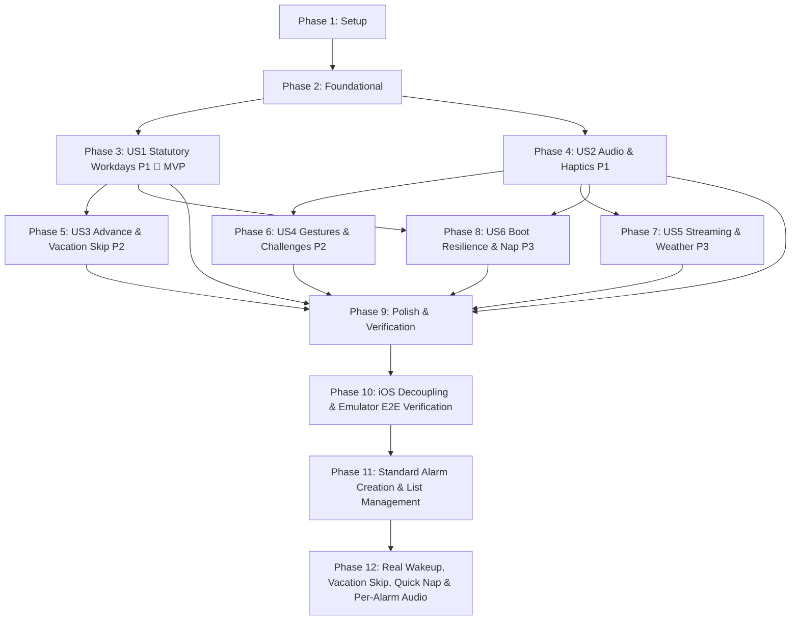

# Implementation Tasks: Android Smart Alarm (智能闹钟)

**Feature**: `001-android-smart-alarm`
**Specification**: [specs/001-android-smart-alarm/spec.md](spec.md)
**Implementation Plan**: [specs/001-android-smart-alarm/plan.md](plan.md)

---

## Phase 1: Setup (Shared Infrastructure)

**Purpose**: Bazel build setup, Android manifest configuration, and multi-module layout.

- [x] T001 Create root Bazel workspace definition in `MODULE.bazel` and root package file in `BUILD.bazel`
- [x] T002 [P] Configure Android application module Bazel build targets and R8 full-mode shrinking rules in `app/BUILD.bazel` and `app/proguard-rules.pro`
- [x] T003 [P] Configure domain core module Bazel library target in `core/BUILD.bazel`
- [x] T004 [P] Configure SQLite persistence module Bazel library target in `data/BUILD.bazel`
- [x] T005 [P] Configure automated unit test Bazel targets in `tests/BUILD.bazel`
- [x] T006 Configure Android manifest with direct-boot awareness and required permissions (`SCHEDULE_EXACT_ALARM`, `USE_EXACT_ALARM`, `RECEIVE_BOOT_COMPLETED`, `VIBRATE`, `WAKE_LOCK`, `MODIFY_AUDIO_SETTINGS`) in `app/AndroidManifest.xml`

---

## Phase 2: Foundational (Blocking Prerequisites)

**Purpose**: Pure SQLite database layer, entities, repository interfaces, and application context initialization.

**⚠️ CRITICAL**: Must be completed before any User Story implementation begins.

- [x] T007 Implement SQLite database open helper with DDL for tables `alarms`, `alarm_skip_rules`, `holiday_calendar`, `app_configurations` and indexes in `data/src/com/edom/alarm/data/db/AlarmDatabaseHelper.java`
- [x] T008 [P] Define database table schemas, column projections, and SQL contracts in `data/src/com/edom/alarm/data/db/DatabaseContract.java`
- [x] T009 [P] Create `AlarmEntity` with verbatim constraints: `hour` (0..23), `minute` (0..59), `is_enabled` (0 or 1), `repeat_mode` (0: Once, 1: Specific Days, 2: Statutory Workdays), `volume` (0..100), `crescendo_seconds` (0..30), `vibration_intensity` (0..100), `force_speaker` (0 or 1), `snooze_interval_minutes` (1..60), `tts_enabled` (0 or 1) in `data/src/com/edom/alarm/data/model/AlarmEntity.java`
- [x] T010 [P] Create `HolidayEntity` (with `day_type`: 0=Workday, 1=Weekend, 2=Statutory Holiday, 3=Compensatory Workday) and `SkipRuleEntity` in `data/src/com/edom/alarm/data/model/HolidayEntity.java` and `data/src/com/edom/alarm/data/model/SkipRuleEntity.java`
- [x] T011 Implement `IAlarmRepository` and transactional SQLite CRUD operations in `data/src/com/edom/alarm/data/repository/IAlarmRepository.java` and `data/src/com/edom/alarm/data/repository/AlarmRepositoryImpl.java`
- [x] T012 [P] Implement `IHolidayRepository` for holiday calendar rule caching and year-range queries in `data/src/com/edom/alarm/data/repository/IHolidayRepository.java` and `data/src/com/edom/alarm/data/repository/HolidayRepositoryImpl.java`
- [x] T013 Create base `AlarmApplication` initializing Direct Boot device-protected storage context via `createDeviceProtectedStorageContext()` in `app/src/com/edom/alarm/AlarmApplication.java`
- [x] T014 Unit test SQLite database schema creation, constraints enforcement, and repository CRUD in `tests/data/AlarmDatabaseTest.java`

**Checkpoint**: Foundation ready - all data access and build foundations operational.

---

## Phase 3: User Story 1 - Statutory Workday & Holiday Smart Scheduling (Priority: P1) 🎯 MVP

**Goal**: Automatic recognition of official Chinese statutory holidays (skip) and weekend compensatory workdays (调休补班响铃), with cloud sync and offline cache.

**Independent Test**: Configure a recurring alarm set to "Statutory Workdays". Verify simulated holiday dates (e.g. National Day) remain silent and compensatory weekend dates (Sunday) ring on schedule.

### Tests for User Story 1
- [x] T015 [P] [US1] Unit test for statutory holiday evaluation rules and date classification in `tests/core/HolidayEngineTest.java`
- [x] T016 [P] [US1] Unit test for next occurrence trigger calculation with statutory workdays and custom bitmasks in `tests/core/AlarmSchedulerTest.java`

### Implementation for User Story 1
- [x] T017 [P] [US1] Implement `IHolidayEngine` interface and holiday/workday classification logic (`WORKDAY=0`, `WEEKEND=1`, `STATUTORY_HOLIDAY=2`, `COMPENSATORY_WORKDAY=3`) in `core/src/com/edom/alarm/core/holiday/IHolidayEngine.java` and `core/src/com/edom/alarm/core/holiday/HolidayEngineImpl.java`
- [x] T018 [P] [US1] Embed offline baseline State Council holiday schedule JSON resource in `app/res/raw/statutory_holidays_baseline.json`
- [x] T019 [US1] Implement cloud holiday rule synchronizer with HTTPS client and local cache update in `core/src/com/edom/alarm/core/holiday/HolidayCloudSyncService.java`
- [x] T020 [US1] Implement `IAlarmScheduler` interface and exact alarm registration using `AlarmManager.setAlarmClock()` in `core/src/com/edom/alarm/core/scheduler/IAlarmScheduler.java` and `core/src/com/edom/alarm/core/scheduler/AlarmSchedulerImpl.java`
- [x] T021 [US1] Implement `AlarmTriggerReceiver` handling `ACTION_ALARM_TRIGGER` and dispatching high-priority full-screen intent in `core/src/com/edom/alarm/core/scheduler/AlarmTriggerReceiver.java`
- [x] T022 [US1] Implement main alarm list UI with statutory workday mode switch in `app/src/com/edom/alarm/ui/MainActivity.java` and layout `app/res/layout/activity_main.xml`

**Checkpoint**: User Story 1 (MVP) fully functional and testable independently.

---

## Phase 4: User Story 2 - Guaranteed Audio, Haptic Wakeup & Audio Routing (Priority: P1)

**Goal**: High-priority alarm audio channel overriding DND/silent modes, built-in loudspeaker routing enforcement, volume crescendo fade-in, and linear motor haptics.

**Independent Test**: Put phone in global silent mode with headphones connected, enable "Always ring via phone speaker" and 15s crescendo, verify loud speaker alarm with smooth volume ramp and heartbeat vibration.

### Tests for User Story 2
- [x] T023 [P] [US2] Unit test for volume crescendo calculation and haptic waveform timing in `tests/core/AudioHapticTest.java`

### Implementation for User Story 2
- [x] T024 [P] [US2] Implement `HapticWaveformFactory` generating Heartbeat, Wave, Staccato, and Continuous vibration effects in `core/src/com/edom/alarm/core/audio/HapticWaveformFactory.java`
- [x] T025 [US2] Implement `IAudioHapticController` interface managing `STREAM_ALARM` audio stream, volume crescendo animator, and loudspeaker routing via `AudioDeviceInfo.TYPE_BUILTIN_SPEAKER` in `core/src/com/edom/alarm/core/audio/IAudioHapticController.java` and `core/src/com/edom/alarm/core/audio/AudioHapticControllerImpl.java`
- [x] T026 [P] [US2] Add lightweight AAC default alarm soundscapes (<50KB each) in `app/res/raw/alarm_gentle.aac` and `app/res/raw/alarm_energetic.aac`
- [x] T027 [US2] Implement `RingingActivity` full-screen wakeup interface with dismiss/snooze actions in `app/src/com/edom/alarm/ui/RingingActivity.java` and layout `app/res/layout/activity_ringing.xml`

**Checkpoint**: User Stories 1 AND 2 operate together, delivering guaranteed audio-haptic awakening.

---

## Phase 5: User Story 3 - Advance Skip & Vacation Multi-Day Calendar Management (Priority: P2)

**Goal**: 30-60 min advance notification card ("Skip Today") without breaking recurrence, and multi-day vacation calendar dismissal with secondary confirmation.

**Independent Test**: Verify advance notification allows single-tap skip for today while tomorrow rings on schedule; verify multi-day calendar deselects specific vacation dates.

### Tests for User Story 3
- [x] T028 [P] [US3] Unit test for temporary skip rules resolution and next-trigger exclusion in `tests/core/SkipRuleTest.java`

### Implementation for User Story 3
- [x] T029 [US3] Implement advance notification card scheduler and `ACTION_SKIP_TODAY` intent handling in `core/src/com/edom/alarm/core/scheduler/AdvanceNotificationManager.java`
- [x] T030 [US3] Implement multi-day vacation calendar dialog with month navigation and date selection/deselection in `app/src/com/edom/alarm/ui/VacationCalendarDialog.java` and layout `app/res/layout/dialog_vacation_calendar.xml`
- [x] T031 [US3] Implement secondary confirmation modal displaying exact skipped dates before persistence in `app/src/com/edom/alarm/ui/SkipConfirmationDialog.java`

**Checkpoint**: Advance single skip and vacation calendar multi-day management independently verified.

---

## Phase 6: User Story 4 - Natural Gestures, Hardware Keys & Anti-Oversleep Challenges (Priority: P2)

**Goal**: Flip to mute/snooze, pick up to lower volume, hardware key mapping, and Math / Shake anti-oversleep challenges.

**Independent Test**: Trigger active alarm, flip face-down to snooze, lift to lower volume, and verify alarm cannot be dismissed until math arithmetic or 30 shakes is completed.

### Tests for User Story 4
- [x] T032 [P] [US4] Unit test for Math challenge arithmetic question generation and answer verification in `tests/core/MathChallengeTest.java`
- [x] T033 [P] [US4] Unit test for Shake challenge acceleration vector detection and progress tracking in `tests/core/ShakeChallengeTest.java`

### Implementation for User Story 4
- [x] T034 [P] [US4] Implement `IChallengeEngine` interface with `MathChallengeStrategy` and `ShakeChallengeStrategy` in `core/src/com/edom/alarm/core/challenge/IChallengeEngine.java`, `core/src/com/edom/alarm/core/challenge/ChallengeEngineImpl.java`, `core/src/com/edom/alarm/core/challenge/MathChallengeStrategy.java`, and `core/src/com/edom/alarm/core/challenge/ShakeChallengeStrategy.java`
- [x] T035 [US4] Implement `AlarmSensorFusionListener` for flip-to-mute and pick-up-to-lower-volume detection using accelerometer and proximity sensors in `core/src/com/edom/alarm/core/sensor/AlarmSensorFusionListener.java`
- [x] T036 [US4] Integrate sensor listeners, hardware key events (Volume / Power), and challenge view into `app/src/com/edom/alarm/ui/RingingActivity.java`

**Checkpoint**: Physical gestures and anti-oversleep challenge strategies fully verified.

---

## Phase 7: User Story 5 - Streaming Music & Dynamic Weather Soundscapes (Priority: P3)

**Goal**: QQ Music / NetEase Cloud Music streaming ringtones with offline local fallback, and dynamic weather soundscapes.

**Independent Test**: Configure streaming or weather ringtone, simulate offline mode, verify instant fallback to local sound with zero delay.

### Tests for User Story 5
- [x] T037 [P] [US5] Unit test for streaming audio error handling and local fallback mechanism in `tests/core/RingtoneFallbackTest.java`

### Implementation for User Story 5
- [x] T038 [US5] Implement streaming audio resolver and platform intent handlers for QQ Music and NetEase Cloud Music in `core/src/com/edom/alarm/core/ringtone/StreamingRingtoneResolver.java`
- [x] T039 [US5] Implement weather condition provider and soundscape acoustic mapper in `core/src/com/edom/alarm/core/ringtone/WeatherRingtoneMapper.java`
- [x] T040 [US5] Integrate streaming search and weather ringtone options into ringtone selector UI in `app/src/com/edom/alarm/ui/RingtonePickerActivity.java` and layout `app/res/layout/activity_ringtone_picker.xml`

**Checkpoint**: Online streaming and dynamic weather soundscape playback verified with offline fallback.

---

## Phase 8: User Story 6 - Cold Boot / App Wakeup, AOD & Quick Nap Utilities (Priority: P3)

**Goal**: Direct Boot / reboot auto-rescheduling, vendor RTC power-off wakeup hooks, 15/30/45/60 min Quick Nap, countdown Toast, and TTS label voice readout.

**Independent Test**: Set a 15-minute quick nap, reboot the phone, verify alarm survives and rings on time, reading out the nap label with TTS.

### Tests for User Story 6
- [x] T041 [P] [US6] Unit test for countdown toast remaining time formatter ("Rings in X days, Y hours, Z minutes") in `tests/core/CountdownFormatterTest.java`

### Implementation for User Story 6
- [x] T042 [US6] Implement `BootCompletedReceiver` for `BOOT_COMPLETED` and `LOCKED_BOOT_COMPLETED` (Direct Boot) in `core/src/com/edom/alarm/core/scheduler/BootCompletedReceiver.java`
- [x] T043 [US6] Implement OEM vendor RTC alarm hooks for Samsung One UI and Vivo/iQOO OriginOS in `core/src/com/edom/alarm/core/scheduler/OemVendorAlarmHook.java`
- [x] T044 [US6] Implement Quick Nap dialog with 15, 30, 45, 60 minute one-tap buttons in `app/src/com/edom/alarm/ui/QuickNapDialog.java` and layout `app/res/layout/dialog_quick_nap.xml`
- [x] T045 [US6] Integrate Text-To-Speech (TTS) label voice readout in `core/src/com/edom/alarm/core/audio/AudioHapticControllerImpl.java`

**Checkpoint**: System boot resilience, vendor RTC hooks, Quick Nap, and TTS utilities verified.

---

## Phase 9: Polish & Cross-Cutting Concerns

**Purpose**: Optimization, build verification, and package size minimization.

- [x] T046 [P] Optimize ProGuard/R8 rules to maximize dead code elimination and class repackaging in `app/proguard-rules.pro`
- [x] T047 Validate zero idle CPU usage and verify Doze battery compliance per `specs/001-android-smart-alarm/quickstart.md`
- [x] T048 Execute all automated unit tests via `/opt/homebrew/bin/bazel test --keep_going //...` and verify green status
- [x] T049 Build production release APK via `/opt/homebrew/bin/bazel build --keep_going //app:alarm_release_apk` and verify APK size is under 3.5MB

---

## Phase 10: Cross-Platform iOS Extensibility & Local Emulator Verification

**Purpose**: Implement pure C++ abstract platform interfaces for future iOS application porting and automated ADB-driven end-to-end verification on `emulator-5554`.

- [x] T050 [P] Define pure C++ abstract platform interfaces (`i_platform_scheduler.h`, `i_platform_audio.h`, `i_platform_haptics.h`, `i_platform_sensor.h`) in `core/include/edom/alarm/core/adapter/`
- [x] T051 [P] Implement C++ mock platform adapters and unit test suite in `tests/core/platform_adapter_test.cc` and add test target to `tests/BUILD.bazel`
- [x] T052 Implement Android JNI platform adapter bridging C++ engine to Android services in `app/src/jni/alarm_jni_bridge.cc`
- [x] T053 Create automated ADB E2E verification test script in `scripts/verify_emulator.sh`
- [x] T054 Execute automated verification script `./scripts/verify_emulator.sh emulator-5554` and validate end-to-end functionality on the active Android emulator

---

## Phase 11: Standard Alarm Creation & List Management

**Purpose**: Provide standard alarm baseline features: TimePicker creation dialog (hour/minute), recurrence options ("Ring Once" default), alarm list card display, and instant On/Off toggle switches.

- [x] T055 [P] Create custom alarm card item layout with formatted time (`HH:mm`), repeat badge, label, and On/Off switch in `app/res/layout/item_alarm_card.xml`
- [x] T056 [P] Create TimePicker creation & edit dialog layout with 24-hour TimePicker, recurrence radio group, day chips, and label input in `app/res/layout/dialog_alarm_edit.xml`
- [x] T057 Implement `AlarmListAdapter` managing card view binding, instant On/Off switch toggle events, and edit/delete callbacks in `app/src/com/edom/alarm/ui/AlarmListAdapter.java`
- [x] T058 Implement `AlarmEditDialog` with native `TimePicker`, default "Ring Once" recurrence, custom day toggles, and SQLite persistence in `app/src/com/edom/alarm/ui/AlarmEditDialog.java`
- [x] T059 Integrate `AlarmListAdapter`, `AlarmEditDialog`, empty state placeholder, and floating add button into `app/src/com/edom/alarm/ui/MainActivity.java`
- [x] T060 Extend automated emulator verification script `scripts/verify_emulator.sh` to test standard TimePicker alarm creation and list switch toggling on `emulator-5554`

---

## Phase 12: Real System Wakeup, Calendar Vacation Skip, Quick Nap Lifecycle & Per-Alarm Audio

**Purpose**: Connect alarms to Android OS `AlarmManager.setAlarmClock()`, implement long-press monthly calendar skip (`VacationCalendarDialog`), in-list Quick Nap countdown cards with auto-destruction, and per-alarm native `RingtoneManager` sound & vibration customization.

- [ ] T061 Integrate real `AlarmManager.setAlarmClock()` and cancellation scheduling in `app/src/com/edom/alarm/ui/MainActivity.java`
- [ ] T062 [P] Implement skipped-dates calendar suppression and WakeLock full-screen alert handling in `core/src/com/edom/alarm/core/scheduler/AlarmTriggerReceiver.java`
- [ ] T063 [P] Add long-press context menu ("Skip Dates / Vacation Mode", "Edit", "Delete") and vacation/nap badge rendering in `app/src/com/edom/alarm/ui/AlarmListAdapter.java` and `app/res/layout/item_alarm_card.xml`
- [ ] T064 Integrate `VacationCalendarDialog` monthly date selection and persistence into `app/src/com/edom/alarm/ui/MainActivity.java`
- [ ] T065 Implement in-list Quick Nap countdown card creation, `AlarmManager` registration, and auto-destruct lifecycle in `app/src/com/edom/alarm/ui/MainActivity.java`
- [ ] T066 [P] Add native `RingtoneManager` sound picker row and vibration toggle Switch in `app/res/layout/dialog_alarm_edit.xml` and `app/src/com/edom/alarm/ui/AlarmEditDialog.java`
- [ ] T067 Extend automated emulator verification script `scripts/verify_emulator.sh` to validate real `AlarmManager` scheduling, monthly vacation date skip, and Quick Nap auto-destruction on `emulator-5554`

---

## Dependencies & Execution Order

### Phase Dependencies

- **Phase 1 (Setup)**: Can start immediately. Unlocks Foundational phase.
- **Phase 2 (Foundational)**: Depends on Phase 1 completion. **BLOCKS all User Stories**.
- **Phase 3 (User Story 1 - P1)**: Depends on Phase 2. Can be delivered as standalone MVP.
- **Phase 4 (User Story 2 - P1)**: Depends on Phase 2. Integrates with US1.
- **Phase 5 (User Story 3 - P2)**: Depends on Phase 2 and US1.
- **Phase 6 (User Story 4 - P2)**: Depends on Phase 2 and US2.
- **Phase 7 (User Story 5 - P3)**: Depends on Phase 2 and US2.
- **Phase 8 (User Story 6 - P3)**: Depends on Phase 2 and US1/US2.
- **Phase 9 (Polish)**: Depends on completion of desired user stories.
- **Phase 10 (iOS Decoupling & Emulator Verification)**: Depends on Phase 9.
- **Phase 11 (Standard Alarm Creation & List Management)**: Builds upon Phase 10; delivers standard time-setting and list management UI.
- **Phase 12 (Real Wakeup, Vacation Skip, Quick Nap & Per-Alarm Audio)**: Builds upon Phase 11; connects real OS alarms, monthly calendar skip, in-list nap lifecycle, and custom ringtones.

### User Story Dependency Graph

---

## Parallel Opportunities

- **Setup Phase**: T002, T003, T004, T005 can execute concurrently.
- **Foundational Phase**: T008, T009, T010, T012 can execute concurrently.
- **User Story 1**: T015 and T016 (Tests), and T017 and T018 (Logic/Assets) can execute concurrently.
- **User Story 2**: T023, T024, T026 can execute concurrently.
- **User Story 4**: T032, T033, T034 can execute concurrently.
- **Phase 10**: T050, T051, and T053 can be developed in parallel.
- **Phase 11**: T055 and T056 (layouts) can execute concurrently with T057/T058.
- **Phase 12**: T062, T063, and T066 can be developed in parallel before integration in T061/T064/T065.

---

## Implementation Strategy

### MVP First (User Story 1 & 2)
1. Complete Phase 1 (Setup) and Phase 2 (Foundational).
2. Complete Phase 3 (US1 Statutory Workdays) and Phase 4 (US2 Audio & Haptics).
3. **STOP and VALIDATE**: Run `/opt/homebrew/bin/bazel test --keep_going //...` and test on-device alarm trigger.
4. Core reliable alarm clock with China statutory workday scheduling is immediately usable.

### Incremental Delivery
- Add Phase 5 (US3): Advance Skip & Vacation Mode.
- Add Phase 6 (US4): Gestures & Anti-Oversleep Challenges.
- Add Phase 7 (US5): Streaming Music & Weather Soundscapes.
- Add Phase 8 (US6): Power-off Alarm, Quick Nap & TTS.
- Run Phase 9 (Polish): ProGuard optimization and final APK size audit.
- Run Phase 10 (iOS & Emulator): Define pure C++ abstract platform interfaces and verify on emulator.
- Run Phase 11 (Standard Alarm UI): Implement TimePicker creation dialog (`AlarmEditDialog`), alarm card list view (`AlarmListAdapter`), empty state, and emulator verification of standard CRUD flows.
- Run Phase 12 (Real Wakeup & Advanced Customization): Implement `AlarmManager.setAlarmClock()` background scheduling, `VacationCalendarDialog` monthly date skip, Quick Nap in-list self-destruct lifecycle, and per-alarm native ringtone/vibration settings.
